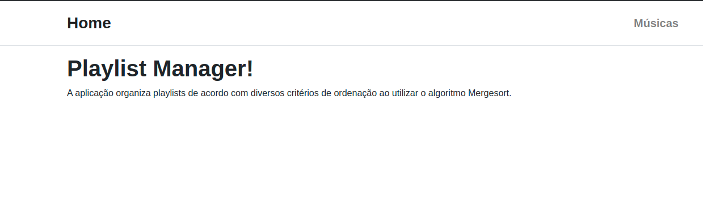
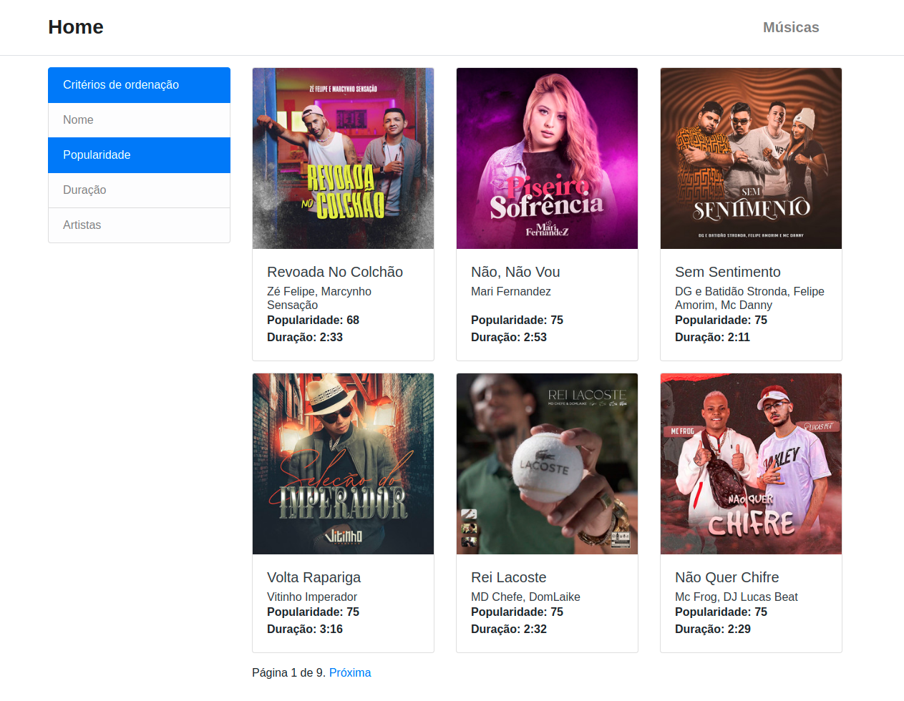

# DC_Playlist_Manager

**Número da Lista**: 2<br>
**Conteúdo da Disciplina**: Dividir e conquistar (Mergesort)<br>

## Alunos
|Matrícula   |               Aluno                  |
| ---------- | ------------------------------------ |
| 15/0132590 |      João Vitor Ramos de Souza       |

## Sobre 

O DC_Playlist_Manager tem como objetivo organizar uma playlist por diversos critérios de ordenação ao utilizar o algoritmo **Mergesort**. No projeto foi utilizada a [API do Spotify](https://developer.spotify.com/documentation/web-api/) para consultar playlists que serão ordenadas na aplicação.

## Screenshots
1. Página inicial da aplicação com texto explicando o objetivo do projeto


2. Página com as playlists ordenadas


## Instalação 
**Linguagem**: Python<br>
**Framework**: Django<br>

Pré-requisitos para rodar o **DC_Playlist_Manager**:

É necessário ter o Python (versão 3.8.x), Pip e docker-compose instalados em seu sistema operacional.

Instale as dependências do Python no seu sistema operacional com o seguinte comando:
```sh
$ git clone https://github.com/projeto-de-algoritmos/DC_Playlist_Manager.git
$ cd DC_Playlist_Manager
$ pip3 install -r requirements.txt
```

Também é necessário ter um banco de dados Postgres sendo executado e para isso foi adicionado o docker-compose para se facilitar a criação do ambiente. Com o docker-compose instalado, basta executar o seguinte comando:

```sh
$ docker-compose up
```

**Importante:** O comando `docker-compose up` irá inutilizar o terminal aberto, para se subir o container do banco de dados em bacground, basta executar o comando `docker-compose up -d`

Realize as migrações do banco de dados com o seguinte comando:
```sh
$ python manage.py migrate
```

Para facilitar a primeira execução do projeto, foi adicionado o arquivo `dump.zip` com um arquivo `json` para carregar o dump de 100 atrações turísticas da cidade de Nova Iorque. Extraia o arquivo `dump.zip` e execute os seguintes comandos para carregar o grafo no banco de dados.

Carregando dados:
```sh
$ python manage.py loaddata playlist_dump.json
```


Suba o servidor Django com o comando abaixo:
```sh
$ python manage.py runserver
```

### Configuração do token do Spotify

Para configurar o token do spotify acesse o link da [API de playlists](https://developer.spotify.com/console/get-current-user-playlists/) e selecione opção `Get Token`, na modal de confirmação selecione aperte o botão `Request Token` e aceite os termos para a utilização da API do Spotify.

Com isso, deve ser copiado o Token para o [arquivo de configurações](/playlist_manager/settings.py) e substitua o valor da variável `SPOTIFY_ACCESS_TOKEN`.

## Uso 

1. Com todos os comandos de instalação já executados, abra seu navegador em `http://localhost:8000/`
2. Após isso, basta acessar .
3. Com as tarefas adicionadas, a tabela na parte inferior da tela será populada com o dia e o número de funcionários necessários para a realização das tarefas

## Outros

Caso não queira utilizar outra playlist, existe um comando disponível para carregar músicas de uma playlist. Para executá-lo é necessário rodar o comando:

```sh
$ python manage.py dump_playlist_data --playlist-id=<ID da playlist no spotify>
```

**Observação:** O ID de uma playlist se localiza após ao final da seguinte URL, indicado por `<id_da_playlist>` no exemplo:

`https://open.spotify.com/playlist/<id_da_playlist>`